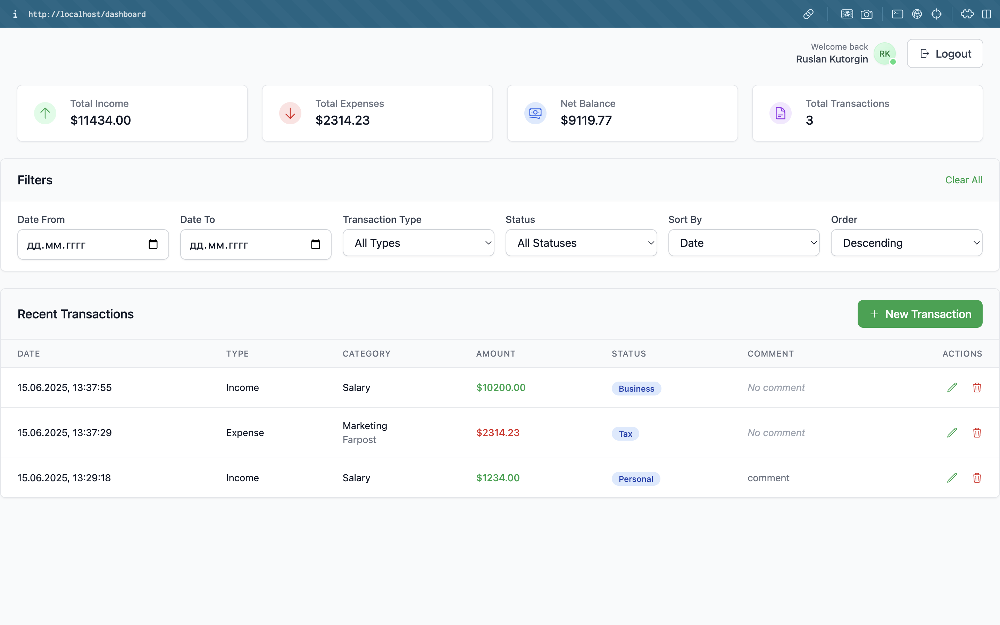
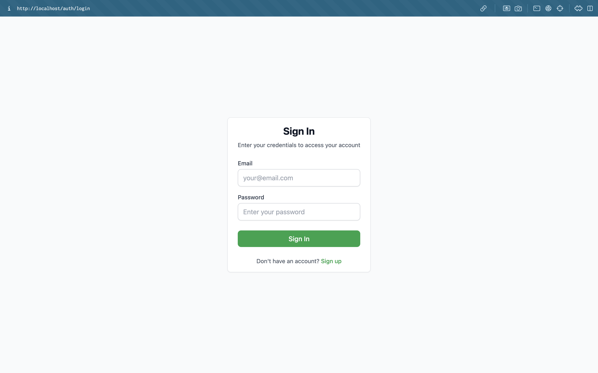

# Money Flow

[](https://www.python.org/)
[](https://www.djangoproject.com/)
[](https://nuxt.com/)
[](https://www.docker.com/)
[](https://pre-commit.com/)
[](https://www.postgresql.org/)
[](LICENSE)

Money Flow is a financial management application that helps you track income, expenses, and manage your personal or business finances. It consists of a Django backend API, a web frontend, and is containerized with Docker for easy deployment.




You can see more screenshots [here](screenshots).

## Tech Stack

**Backend:**

- Python 3.13+
- Django (REST API)
- PostgreSQL (database)

**Frontend:**

- Nuxt.js (Vue 3)
- Tailwind CSS

## Project Structure

- `backend/` - Django backend API
- `frontend/` - Nuxt.js frontend
- `deployments/` - Docker configuration for development and production environments

---

## Production Setup (Quick Start)

### Prerequisites

Before you begin, ensure you have the following installed on your local machine:

- [Git](https://git-scm.com/downloads)
- [GNU Make](https://www.gnu.org/software/make/)
- [Docker](https://docs.docker.com/get-docker/) and [Docker Compose](https://docs.docker.com/compose/install/)

### 1. Clone the repository

```bash
git clone https://github.com/teenxsky/money-flow.git
cd money-flow
```

### 2. Set up environment variables

Create local environment files based on the examples:

```bash
cd deployments/prod/conf
cp .env.docker .env.docker.local
cp .env.backend .env.backend.local
```

Fill in the required fields in newly created `.env.docker.local` and `.env.backend.local` files.

### 3. Build and start the production environment

From the project root:

```bash
make build
make up
```

- To view logs in the foreground:

  ```bash
  make up-logs
  ```

- To stop the production environment:

  ```bash
  make clean
  ```

- To remove volumes as well:

  ```bash
  make clean-volumes
  ```

- **To learn more about available commands**:
  ```bash
  make help
  ```

### 4. Access the application

The application will be available at:

- Frontend: http://localhost:80/
- Backend API: http://api.localhost:80/
- Backend docs (Swagger UI): http://api.localhost:80/v1/docs/
- Backend admin panel: http://api.localhost:80/admin

You can also read the backend documentation in form of OpenAPI specification: [v1.yaml](backend/docs/v1.yaml).
Or you can look at the screenshot of the Swagger UI documentation: [v1.jpeg](backend/docs/v1.jpeg).

---

## Development Setup

Read the development manual in the [DEV_GUIDE.md](DEV_GUIDE.md) file.

## License

This project is licensed under the Apache License - see the [LICENSE](LICENSE) file for details.
